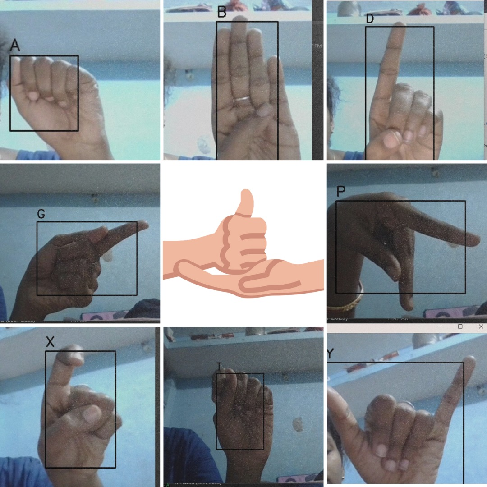
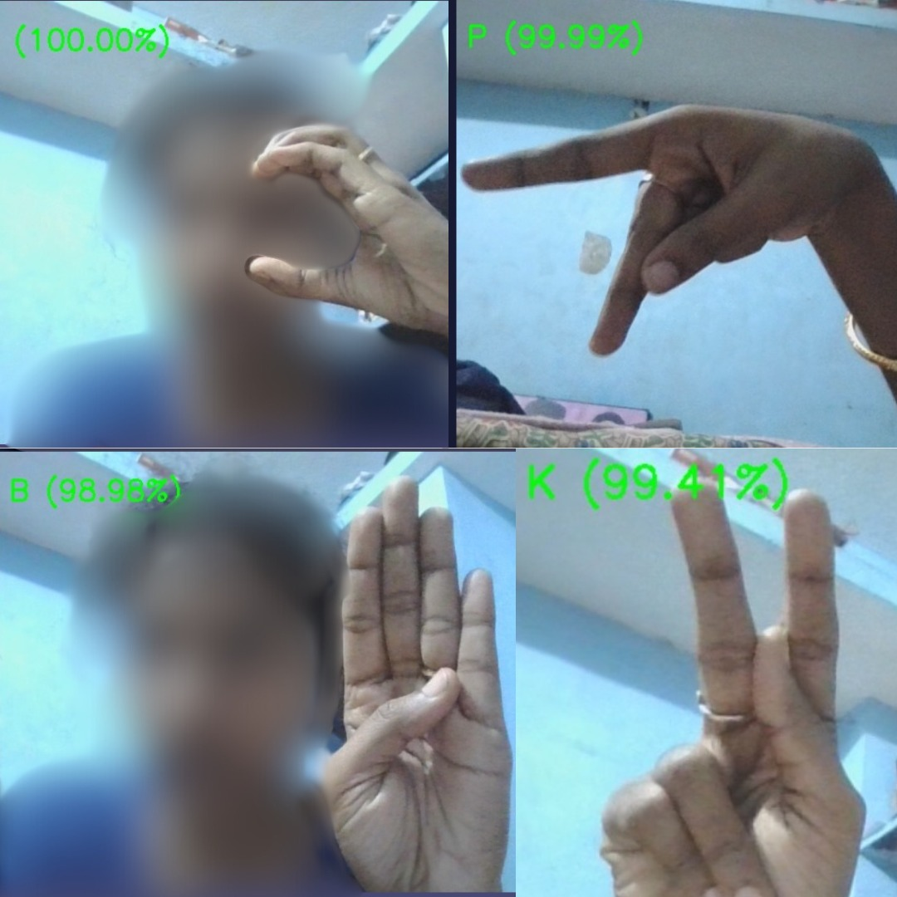

# Sign Language Recognition for Letter Prediction

This project uses **Convolutional Neural Networks (CNN)** for sign language recognition, specifically for predicting individual letters of the alphabet based on video frames. The model is trained using a custom dataset, where each letter has 100 frames. The project also integrates a real-time prediction system through a web application.

## Project Overview

- **Dataset**: Custom dataset with 100 frames per letter, representing sign language alphabets.
- **Model**: CNN-based architecture for classifying individual letters.
- **Real-Time Prediction**: Flask framework used for serving the trained model to make predictions in real-time.
- **Web Interface**: Built with HTML, CSS, and Bootstrap to display predictions and interact with the user.
- **Next Steps**: Moving towards word prediction, where sequences of letters will be predicted in real-time.

## Features

- Real-time sign language recognition for individual letters.
- User-friendly interface to upload video input for prediction.
- Displaying prediction results in the form of the predicted letter.
- Future work will extend the system to predict entire words based on sequences of letters.

## Technologies Used

- **Python** (for machine learning and Flask server)
- **HTML, CSS, Bootstrap** (for website frontend)
- **Flask** (for backend and model integration)
- **TensorFlow/Keras** (for training the CNN model)

## How to Run

1. Clone the repository.
2. Install the necessary dependencies:
   ```bash
   pip install -r requirements.txt
3. Place the trained CNN model file in the appropriate directory.
4. Run the Flask server:
   ```bash
   python app.py   
5. Open the website in a browser and start using the real-time prediction system.

## Images and Webpage

Below are some images demonstrating the prediction process:

 **Sample Prediction Image**:
  
  

 **Webpage Gif**:
  

## Future Work

- **Word Prediction**: Extend the model to predict words by recognizing sequences of letters.
- **Improved UI/UX**: Refine the user interface for a more interactive experience.
- **Performance Improvements**: Fine-tune the model for faster and more accurate predictions.


  


